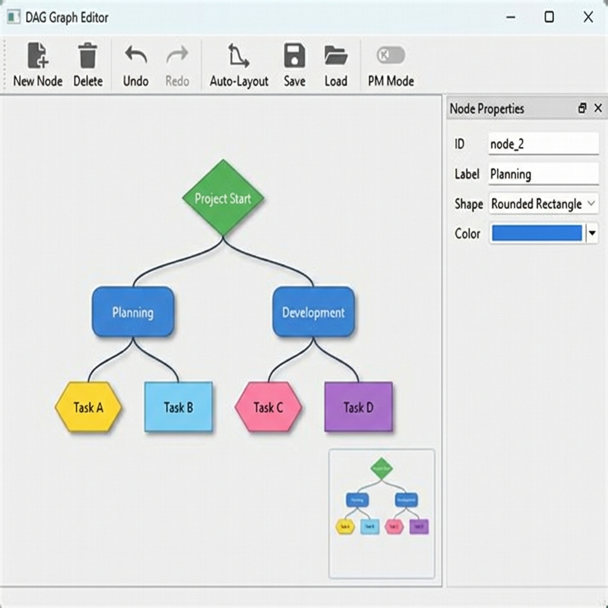

# DAG Graph Editor

DAG Graph Editor is a desktop application for creating and editing directed acyclic graphs (DAGs). It is written in Python with PySide6. In addition to general graph editing, the application includes an optional project-management mode for dependency graphs and critical-path calculations.



## Scope

The application provides:

- visual editing of DAG nodes and parent-child relationships
- undo and redo for graph changes
- node shapes including `circle`, `rect`, `rounded-rect`, `diamond`, `hexagon`, `triangle`, and `projektnode`
- per-node custom data edited as JSON
- JSON save and load
- PNG export of the current scene with a transparent background
- automatic layout using `networkx`
- a minimap and docked side panels
- an optional project-management mode with `FS`, `SS`, `FF`, and `SF` dependencies, lag values, CPM fields, and critical-path highlighting

## Installation

```bash
git clone https://github.com/horbachM-cpu/dag-graph-editor.git
cd dag-graph-editor
pip install -r requirements.txt
```

Requirements:

- Python 3
- `PySide6`
- `networkx`

## Start

Run the application with:

```bash
python dag_graph_editor.py
```

The main window opens with a small sample graph.

## Usage

Basic editing:

- create, delete, and move nodes on the canvas
- select a node to edit its properties in the side panels
- use `Re-Parent Mode` to assign a different parent
- use the toolbar for undo, redo, auto-layout, zoom, and fit-to-view

Persistence and export:

- `Save Graph` writes the current document to JSON
- `Load Graph` reads a saved JSON document
- `Export PNG` exports the current scene to a PNG file

Project-management mode:

- `PM Mode On/Off` enables PM-specific rendering and calculations
- new nodes created in PM mode use the `projektnode` shape
- `Link Activities (PM)` adds typed dependencies with lag values
- `Calculate Critical Path` updates CPM values and highlights critical activities

Example files are available in [`examples/sample_graph.json`](examples/sample_graph.json) and [`examples/project_management_demo.json`](examples/project_management_demo.json).

## Development

Run the minimal test suite with:

```bash
python -m unittest discover -s tests -v
```

## JSON Format

Saved documents are JSON objects with:

- document metadata
- graph settings
- node labels, shapes, colors, layout positions, and custom data
- optional project-management data and dependency definitions

## Project Structure

- [`dag_graph_editor.py`](dag_graph_editor.py): application entry point
- [`dag_graph_editor/main.py`](dag_graph_editor/main.py): main window, toolbar actions, file operations
- [`dag_graph_editor/model.py`](dag_graph_editor/model.py): graph document model, JSON serialization, PM/CPM logic
- [`dag_graph_editor/views.py`](dag_graph_editor/views.py): graphics view, minimap, PNG export
- [`dag_graph_editor/items.py`](dag_graph_editor/items.py): node and edge rendering
- [`dag_graph_editor/panels.py`](dag_graph_editor/panels.py): dock widgets and help window
- [`dag_graph_editor/commands.py`](dag_graph_editor/commands.py): undo/redo commands
- [`examples/`](examples): example graph documents
- [`screenshots/`](screenshots): repository screenshots

## License

[MIT License](LICENSE)
